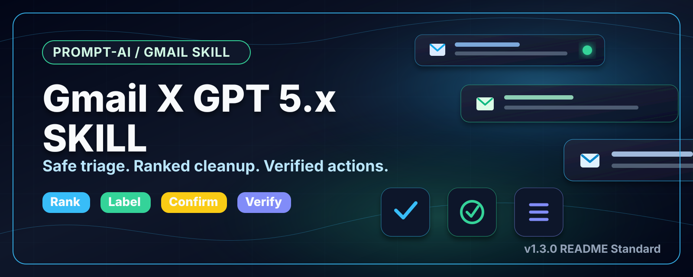
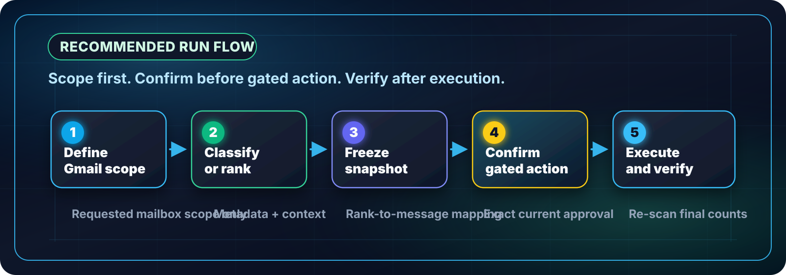

# Gmail X GPT 5.x SKILL

[](#version)
[](SKILL.md)
[](docs/safety-rules.md)
[](LICENSE)

Professional Prompt-AI and reusable SKILL framework for Gmail triage, label governance, ranked sender cleanup, and contract-related email review with GPT 5.x.

## Executive Overview

This repository converts recurring Gmail operations into auditable AI workflows. It is designed for use with GPT 5.x, Codex, GitHub Copilot, and connected Gmail tools where mailbox actions must be scoped, explainable, reversible, and explicitly authorized.

Core operating principle:

> Search, classify, label, and verify first. Delete, move, send, archive, mark read, or change settings only when the current user instruction explicitly authorizes that exact action.

## Author And License

| Item | Detail |
|---|---|
| ผู้รวบรวม / ผู้เขียน | Phumin Decoknoi |
| Compiled and authored by | Phumin Decoknoi |
| AI-assisted drafting | OpenAI ChatGPT / Codex was used to help structure, draft, review, and standardize repository content |
| License | [Creative Commons Attribution-NonCommercial 4.0 International](LICENSE) |
| Commercial use | Not permitted without prior written permission from the author |
| Attribution | Required for any permitted non-commercial sharing or adaptation |

License summary:

- You may share and adapt this repository for non-commercial purposes with proper attribution.
- You may not sell, resell, package, sublicense commercially, or use this repository as part of paid commercial services without prior written permission.
- The full controlling license is the official [CC BY-NC 4.0 International legal code](https://creativecommons.org/licenses/by-nc/4.0/legalcode).
- This repository contains Prompt-AI patterns, SKILL files, examples, diagrams, and documentation intended for professional learning and controlled internal workflow design.

## What You Can Do

| Capability | Use when | Start here |
|---|---|---|
| New-message labeling | You want recent Inbox and Spam messages classified with existing labels | [gmail-new-message-auto-labeler.prompt.md](prompts/gmail-new-message-auto-labeler.prompt.md) |
| Manual Inbox labeling | You want a selected Gmail scope classified by a standard taxonomy | [gmail-inbox-labeler.prompt.md](prompts/gmail-inbox-labeler.prompt.md) |
| Ranked sender cleanup | You want to rank Inbox senders, keep selected ranks, and move the rest to Trash after confirmation | [id01-skill-email-sender-cleanup](skills/id01-skill-email-sender-cleanup/SKILL.md) |
| Contract review | You want contract, agreement, invoice, receipt, or service-term messages surfaced | [gmail-contract-review.prompt.md](prompts/gmail-contract-review.prompt.md) |
| Safety governance | You want to know which Gmail actions require explicit confirmation | [safety-rules.md](docs/safety-rules.md) |

## Quick Start

1. Read the governing skill: [SKILL.md](SKILL.md).
2. Select the workflow from [docs/workflows.md](docs/workflows.md).
3. Use the label standard in [docs/label-taxonomy.md](docs/label-taxonomy.md).
4. Run the matching prompt from [prompts/](prompts/).
5. For ranked cleanup, use [id01-skill-email-sender-cleanup](skills/id01-skill-email-sender-cleanup/SKILL.md) before taking action.
6. Verify the result using [docs/operations.md](docs/operations.md).

## Skill Hub

Use this section as the main skill directory for the repository. Start with the root skill, then open the matching sub-skill, prompt, reference, and example for the requested Gmail task.

### Skill Index

| Level | Skill file | Purpose | Use when |
|---|---|---|---|
| Root | [SKILL.md](SKILL.md) | Governing skill for Gmail triage, labeling, sender ranking, cleanup boundaries, contract review, output style, and verification | Every run in this repository |
| Sub-skill `id01` | [skills/id01-skill-email-sender-cleanup/SKILL.md](skills/id01-skill-email-sender-cleanup/SKILL.md) | Controlled ranked-sender cleanup skill with frozen snapshot, kept ranks, Trash-only execution, and verification | The user asks to rank Inbox senders, keep selected ranks, and remove the rest from Inbox |

### Related Skill Files

| Skill area | Main file | Supporting files |
|---|---|---|
| Gmail operating model | [SKILL.md](SKILL.md) | [docs/workflows.md](docs/workflows.md), [docs/operations.md](docs/operations.md), [docs/safety-rules.md](docs/safety-rules.md) |
| Ranked sender cleanup | [skills/id01-skill-email-sender-cleanup/SKILL.md](skills/id01-skill-email-sender-cleanup/SKILL.md) | [sender-ranking-standard.md](skills/id01-skill-email-sender-cleanup/references/sender-ranking-standard.md), [keep-ranks-run.md](skills/id01-skill-email-sender-cleanup/examples/keep-ranks-run.md), [gmail-ranked-sender-cleanup.prompt.md](prompts/gmail-ranked-sender-cleanup.prompt.md) |
| Prompt-AI structure | [docs/prompt-patterns.md](docs/prompt-patterns.md) | [prompts/](prompts/), [examples/](examples/) |
| Label governance | [docs/label-taxonomy.md](docs/label-taxonomy.md) | [gmail-inbox-labeler.prompt.md](prompts/gmail-inbox-labeler.prompt.md), [gmail-new-message-auto-labeler.prompt.md](prompts/gmail-new-message-auto-labeler.prompt.md) |
| Repository maintenance | [docs/repository-standard.md](docs/repository-standard.md) | [CONTRIBUTING.md](CONTRIBUTING.md), [.github/copilot-instructions.md](.github/copilot-instructions.md) |

### Skill Selection Guide

| User request | Use skill | Use prompt | Required safety rule |
|---|---|---|---|
| "ตรวจเมลใหม่และติด label" | [SKILL.md](SKILL.md) | [gmail-new-message-auto-labeler.prompt.md](prompts/gmail-new-message-auto-labeler.prompt.md) | Apply labels only; do not delete, archive, send, or mark read |
| "ช่วยจัดหมวดหมู่ Inbox" | [SKILL.md](SKILL.md) | [gmail-inbox-labeler.prompt.md](prompts/gmail-inbox-labeler.prompt.md) | Use the standard label taxonomy and report label counts |
| "แยกผู้ส่งใน Inbox เรียงมากไปน้อย" | [SKILL.md](SKILL.md) | [gmail-ranked-sender-cleanup.prompt.md](prompts/gmail-ranked-sender-cleanup.prompt.md) | Ranking is read-only; do not move messages |
| "เก็บ rank 1 2 3 แล้วลบที่เหลือ" | [id01-skill-email-sender-cleanup](skills/id01-skill-email-sender-cleanup/SKILL.md) | [gmail-ranked-sender-cleanup.prompt.md](prompts/gmail-ranked-sender-cleanup.prompt.md) | Freeze rank snapshot, confirm scope, move non-kept Inbox messages to Trash only |
| "ค้นหาอีเมลเกี่ยวกับสัญญา/ใบแจ้งหนี้" | [SKILL.md](SKILL.md) | [gmail-contract-review.prompt.md](prompts/gmail-contract-review.prompt.md) | Search and classify only unless separate action is authorized |

### How To Use A Skill

1. Open the governing skill: [SKILL.md](SKILL.md).
2. Identify the workflow from [docs/workflows.md](docs/workflows.md).
3. If the workflow has a sub-skill, open that sub-skill before using the prompt.
4. Open the matching prompt in [prompts/](prompts/).
5. Fill in the user-controlled variables: Gmail scope, time window, labels, keep ranks, and allowed action.
6. Execute the workflow in the order written in the skill file.
7. Apply the verification checklist before reporting the result.
8. Report limitations clearly if Gmail results are incomplete, paginated, or blocked by tool constraints.

### Copy-Paste Invocation Pattern

Use this pattern when running the repository as a Prompt-AI / SKILL workflow:

```text
/USE SKILL: gmail-x-gpt-5x-skill
/USE ROOT SKILL: SKILL.md
/USE SUB-SKILL: skills/id01-skill-email-sender-cleanup/SKILL.md
/USE PROMPT: prompts/gmail-ranked-sender-cleanup.prompt.md

Task:
[ระบุงาน Gmail ที่ต้องการ]

Variables:
- Gmail scope: in:inbox
- Time window: [ระบุช่วงเวลา หรือ none]
- Keep ranks: [เช่น 1, 2, 5 หรือ none]
- Allowed action: [label only / read only / move non-kept Inbox messages to Trash]

Output:
- Language: Thai
- Format: Tables plus concise audit-ready summary
- Verification: Include final counts and safety statement
```

For non-cleanup workflows, replace the sub-skill and prompt path with the matching file from the Skill Selection Guide.

### Skill Operating Rules

| Rule | Standard |
|---|---|
| Source boundary | Use connected Gmail data only unless the user explicitly requests another source |
| Sender identity | Normalize senders by email address first, then use display name as supporting context |
| Rank validity | Rank numbers are valid only for the current frozen run |
| Cleanup mode | Move to Trash only; permanent delete is outside the default workflow |
| Confirmation | Require exact current authorization before Trash, delete, archive, send, forward, draft, mark read/unread, filters, settings, or unsubscribe |
| Verification | Re-scan the affected Gmail scope and report final counts |

## Recommended Run Flow



Use the flow this way:

| Stage | Required control |
|---|---|
| Define Gmail scope | Search only the mailbox scope requested by the user |
| Classify or rank | Use metadata, snippets, and body context only as needed |
| Freeze snapshot | Preserve rank-to-sender-to-message mapping before cleanup |
| Confirm gated action | Require exact current authorization for delete, Trash, archive, send, or read-status changes |
| Execute and verify | Re-scan the affected Gmail scope and report final counts |

## Repository Map

| Path | Purpose |
|---|---|
| [README.md](README.md) | Public front page and navigation hub |
| [SKILL.md](SKILL.md) | Root skill, boundaries, workflows, and verification checklist |
| [prompts/](prompts/) | Ready-to-run Prompt-AI files |
| [skills/](skills/) | Modular sub-skills for high-control workflows |
| [docs/](docs/) | Taxonomy, operations, safety rules, prompt patterns, and repository standard |
| [examples/](examples/) | Copy-paste run examples |
| [.github/copilot-instructions.md](.github/copilot-instructions.md) | GitHub Copilot and Codex contributor guidance |
| [assets/](assets/) | README title/banner images and visual assets |

## Sub-Skill Registry

| ID | Sub-skill | Purpose | Main prompt |
|---|---|---|---|
| `id01` | [id01-skill-email-sender-cleanup](skills/id01-skill-email-sender-cleanup/SKILL.md) | Rank Inbox senders, keep selected ranks, and move non-kept Inbox messages to Trash using a frozen snapshot | [gmail-ranked-sender-cleanup.prompt.md](prompts/gmail-ranked-sender-cleanup.prompt.md) |

### ID01 Usage Detail

Use `id01` only after the user asks for sender ranking cleanup or gives kept rank numbers. The workflow must preserve a frozen mapping before moving anything:

| Step | Required output |
|---|---|
| Rank senders | Table with rank, sender, email address, Inbox count, and sample subjects |
| Freeze snapshot | Mapping of kept rank numbers to exact sender email addresses and message IDs |
| Confirm action | Clear Trash scope before any write action, unless the current instruction already authorizes the exact cleanup |
| Execute | Move only non-kept Inbox messages to Trash |
| Verify | Final count of kept senders, moved senders, moved messages, and remaining Inbox messages |

Example command:

```text
/USE SKILL: gmail-x-gpt-5x-skill
/USE SUB-SKILL: skills/id01-skill-email-sender-cleanup/SKILL.md
/USE PROMPT: prompts/gmail-ranked-sender-cleanup.prompt.md

แยกผู้ส่งใน Inbox เรียงจากมากไปน้อย ใส่ลำดับ 1 ถึง N
จากนั้นเก็บลำดับ 1, 2, 4 และย้ายอีเมลของผู้ส่งลำดับอื่นใน Inbox ไป Trash
ให้แสดง frozen snapshot และ verification summary หลังดำเนินการ
```

## Prompt-AI Standard

Every prompt in this repository follows the same professional control pattern:

```text
Role -> Objective -> Source Boundary -> Workflow -> Output Contract -> Constraints -> Verification -> Fallback
```

For implementation details, see [docs/prompt-patterns.md](docs/prompt-patterns.md).

## Safety Gates

The default safe actions are search, inspect, classify, summarize, and label when the user requests classification or triage.

These actions are gated and require exact current authorization:

| Gated action | Required authorization |
|---|---|
| Move to Trash or delete | The user must authorize the exact scope and action |
| Permanent delete | Separate explicit confirmation is required |
| Archive or remove from Inbox | The user must authorize the exact target scope |
| Send, reply, forward, or draft | The user must authorize the recipient and action |
| Mark read or unread | The user must authorize the status change |
| Filters, settings, unsubscribe | The user must authorize the exact account-level change |

See [docs/safety-rules.md](docs/safety-rules.md) for the full safety standard.

## Label Taxonomy

The canonical labels are maintained in [docs/label-taxonomy.md](docs/label-taxonomy.md). Use specific labels before `99_Archive-LowPriority`, and apply `00_SPAM-Review-Red` for Spam review.

| Label family | Examples |
|---|---|
| Work and development | `01_Work-GitHub`, `08_AI-SaaS` |
| Personal and finance | `02_Personal-Self`, `03_Finance-Bank`, `12_Receipt-Tax-Invoice` |
| Learning and professional | `05_Education-Learning`, `06_HR-Professional`, `09_Research-Academia` |
| Security and low priority | `13_Security-Account`, `99_Archive-LowPriority` |

## Examples

| Example | What it demonstrates |
|---|---|
| [keep-rank-run.md](examples/keep-rank-run.md) | Ranked sender cleanup run pattern |
| [new-message-auto-labeler-run.md](examples/new-message-auto-labeler-run.md) | Recent Inbox and Spam labeling run pattern |
| [skills/id01.../examples/keep-ranks-run.md](skills/id01-skill-email-sender-cleanup/examples/keep-ranks-run.md) | Sub-skill controlled cleanup example |

## Version

Current version: `v1.3.3-author-license`

Latest update:

- Added author/compiler attribution and international non-commercial license notice.
- Replaced the previous MIT license badge with `CC BY-NC 4.0`.
